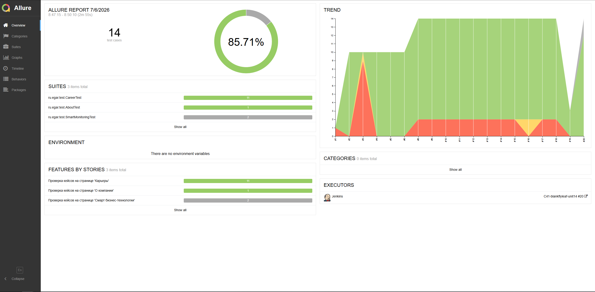
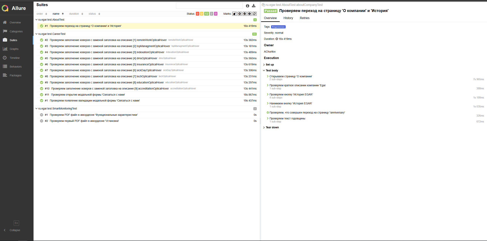
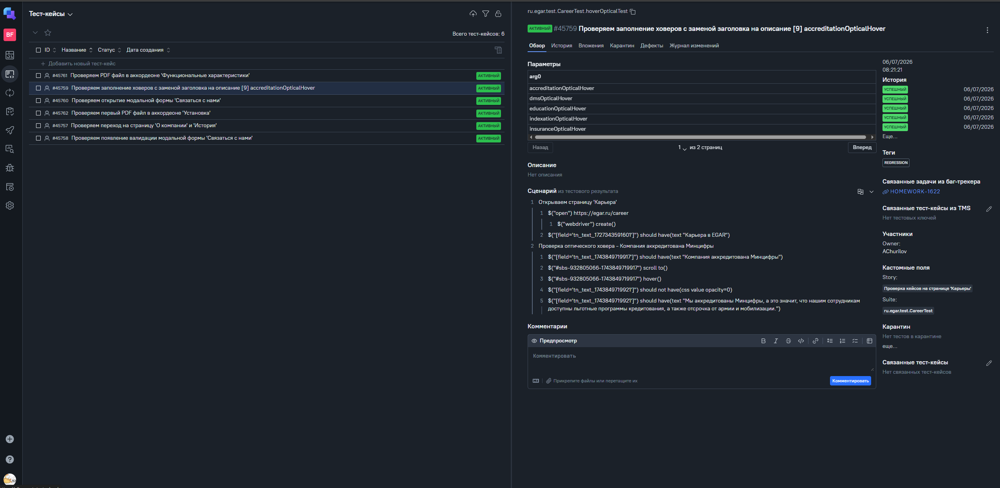
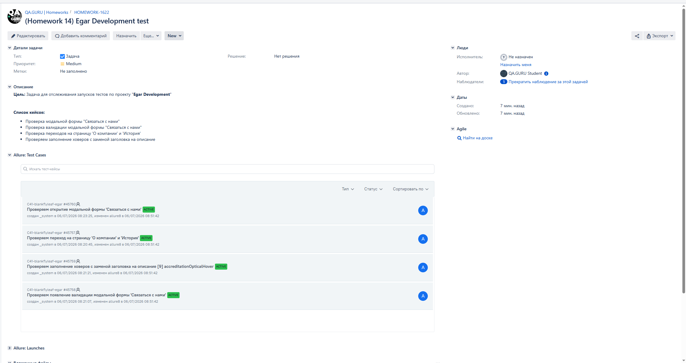

<h1 align="center">Проект по автоматизации тестирования для компании</h1>
<div align="center">  
<a href="https://egar.ru"></a>  
</div>  

>**EGAR** — российская IT-компания, специализирующаяся на разработке корпоративного программного обеспечения для крупных организаций и финансовых структур. Портфель продуктов включает системы бизнес-мониторинга, инструменты аналитики и контроля бизнес-процессов в режиме реального времени. Компания представлена в десяти городах России и СНГ.

---

## Содержание
- [Технологии и инструменты](#технологии-и-инструменты)К
- [Покрытый функционал](#покрытый-функционал)
- [Запуск тестов](#запуск-тестов)
- [Allure отчёт](#allure-отчёт)
- [Allure TestOps](#allure-testops)
- [Интеграция с Jira](#интеграция-с-jira)
- [Уведомления в Telegram](#уведомления-в-telegram)
- [Видео прохождения теста](#видео-прохождения-теста)

---

## Технологии и инструменты

[](https://www.java.com)
[](https://gradle.org)
[](https://junit.org/junit5/)
[](https://selenide.org)
[](https://aerokube.com/selenoid/)
[](https://allurereport.org)

---

## Покрытый функционал

| Страница                | Тест-кейс | Тег | Severity |
|-------------------------|---|---|---|
| Карьера                 | Проверка открытия модальной формы «Связаться с нами» | Smoke, Regression | Blocker |
| Карьера                 | Проверка появления валидации модальной формы «Связаться с нами» | Smoke, Regression | Critical |
| Карьера                 | Параметризованная проверка ховеров с заменой заголовка на описание | Regression | Normal |
| О компании              | Проверка перехода на страницу «О компании» и «История» | Regression | Normal |
| Смарт Бизнес-Мониторинг | Проверка PDF-файла в аккордеоне «Функциональные характеристики» | Regression | Normal |
| Смарт Бизнес-Мониторинг | Проверка первого PDF-файла в аккордеоне «Установка» | Regression | Normal |

---

## Запуск тестов

### Локально
```bash
./gradlew test
```

### Запуск по тегам
```bash
./gradlew test -DincludeTags=Smoke
./gradlew test -DincludeTags=Regression
```

### Параметры запуска

| Параметр | Описание | Значение по умолчанию |
|---|---|---|
| `BROWSER` | Браузер | `chrome` |
| `BROWSER_VERSION` | Версия браузера | — |
| `BROWSER_SIZE` | Размер окна | `1920x1080` |
| `BASE_URL` | Адрес сайта | https://egar.ru |
| `SELENOID_URL` | Адрес Selenoid | — |
| `SELENOID_CREDENTIAL` | Логин:пароль Selenoid | — |


### С параметрами (через Jenkins или терминал)
```bash
./gradlew test \
  -DBROWSER=chrome \
  -DBROWSER_VERSION=120.0 \
  -DBROWSER_SIZE=1920x1080 \
  -DBASE_URL=https://egar.ru \
  -DSELENOID_URL=<selenoid-host> \
  -DSELENOID_CREDENTIAL=<user:password>
```

---

## [Allure отчет](https://jenkins.autotests.cloud/view/blankFlyleaf_jobs/job/C41-blankflyleaf-unit14/allure/)

### *Основная страница отчёта*

<div align="center">  
  
</div>  

### *Тест-кейсы*

<div align="center">  
  
</div>

### *Графики*

<div align="center">  
  
</div>

---

## [Allure TestOps](https://allure.autotests.cloud/project/5104/dashboards)

### *Основная страница*
<p align="center">  
  
</p>

### *Страница кейсов*
<div align="center">  
  
</div>

---

## [Интеграция с Jira](https://jira.autotests.cloud/browse/HOMEWORK-1622)

<div align="center">  
  
</div>


---

## Уведомления в Telegram

<div align="center">  
  
</div>

---

## Видео прохождения теста
<div align="center">
   
</div>